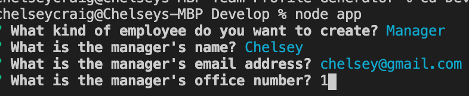
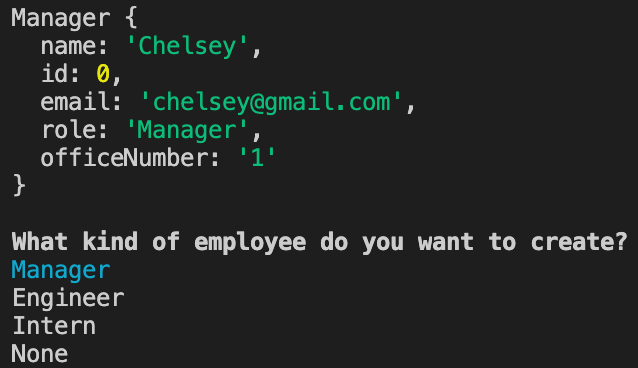
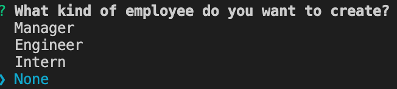
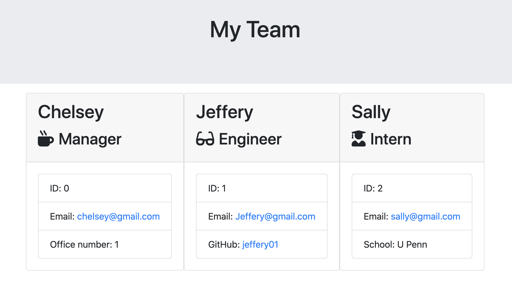
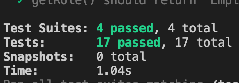

# Team-Profile-Generator

## Description

This application will allow user to organize his/her employees by category and provide a variety of information input by the user. This information will be shown in an html page that will automatically populate after the user is finished adding all of the employees.

___

## How it Works

In order for this application to work the user will need to use the terminal to run the program.  The first questions the user will be asked is what kind of employee he/she wishes to create.  The user can chose from either a manager, engineer, or and intern to be added to the profile. 
  

  

From there, the user will select which type of employee to added and then be prompted to answer a series of questions that pertain to that certain type of employee. Each type of employee has been coded with a function that will get the employee information that was provided by the user that is then placed into an array that stores the information for each individual employee inputted into the system.

  

  

After the user has answered all the questions for that particular employee, he/she will be asked if a new employee needs to be added.  The user can add as many employees as desired. If the user does choose to add a new employee, the newEmployee function is rerun and will take the user back to the beginning of the process.

  

  

Should the user choose not to add a new employee, the render function will be run that writes all the collected employee data and places it into the team.html page that is preset to generate when the command line application is done being run.

  

  

The team.html page is shown below and will contain all the information that user input as well as include clickable links for emails, github name, as well as showcase the different classes that I extended for each different employee.

  

  

___

## Tests

This application had a total of 4 test suites for a total of 17 test that we run. This application successfully passed all 17 tests.

  

  
___

### Link to Video Guide
 
https://github.com/ccraig7321/Team-Profile-Generator
  
___

### License

Copyright 2020 CHELSEY CRAIG

Permission is hereby granted, free of charge, to any person obtaining a copy of this software and associated documentation files (the "Software"), to deal in the Software without restriction, including without limitation the rights to use, copy, modify, merge, publish, distribute, sublicense, and/or sell copies of the Software, and to permit persons to whom the Software is furnished to do so, subject to the following conditions:

The above copyright notice and this permission notice shall be included in all copies or substantial portions of the Software.

THE SOFTWARE IS PROVIDED "AS IS", WITHOUT WARRANTY OF ANY KIND, EXPRESS OR IMPLIED, INCLUDING BUT NOT LIMITED TO THE WARRANTIES OF MERCHANTABILITY, FITNESS FOR A PARTICULAR PURPOSE AND NONINFRINGEMENT. IN NO EVENT SHALL THE AUTHORS OR COPYRIGHT HOLDERS BE LIABLE FOR ANY CLAIM, DAMAGES OR OTHER LIABILITY, WHETHER IN AN ACTION OF CONTRACT, TORT OR OTHERWISE, ARISING FROM, OUT OF OR IN CONNECTION WITH THE SOFTWARE OR THE USE OR OTHER DEALINGS IN THE SOFTWARE.

___

