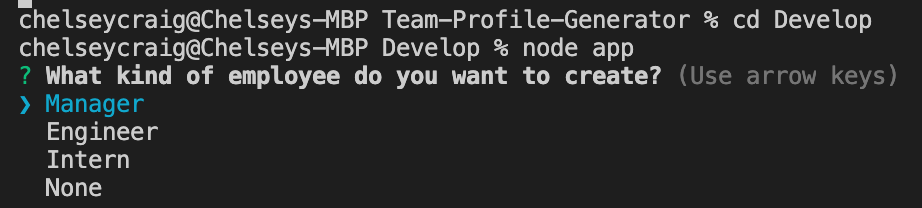

# Team-Profile-Generator

## Description

This application will allow user to organize his/her employees by category and provide a variety of information input by the user. This information will be shown in an html page that will automatically populate after the user is finished adding all of the employees.

___

## How it Works

In order for this application to work the user will need to use the terminal to run the program.  The first questions the user will be asked is what kind of employee he/she wishes to create.  The user can chose from either a manager, engineer, or and intern to be added to the profile. 
   

   

From there, the user will select which type of employee to added and then be prompted to answer a series of questions that pertain to that certain type of employee. Each type of employee has been coded with a function that will get the employee information that was provided by the user that is then placed into an array that stores the information for each individual employee inputted into the system.

   

   

After the user has answered all the questions for that particular employee, he/she will be asked if a new employee needs to be added.  The user can add as many employees as desired. If the user does choose to add a new employee, the newEmployee function is rerun and will take the user back to the beginning of the process.

   

   

Should the user choose not to add a new employee, the render function will be run that writes all the collected employee data and places it into the team.html page that is preset to generate when the command line application is done being run.

   

   

The team.html page is shown below and will contain all the information that user input as well as include clickable links for emails, github name, as well as showcase the different classes that I extended for each different employee.

   

   

___

## Tests

___

### Link to Video Guide

___

### License

___

